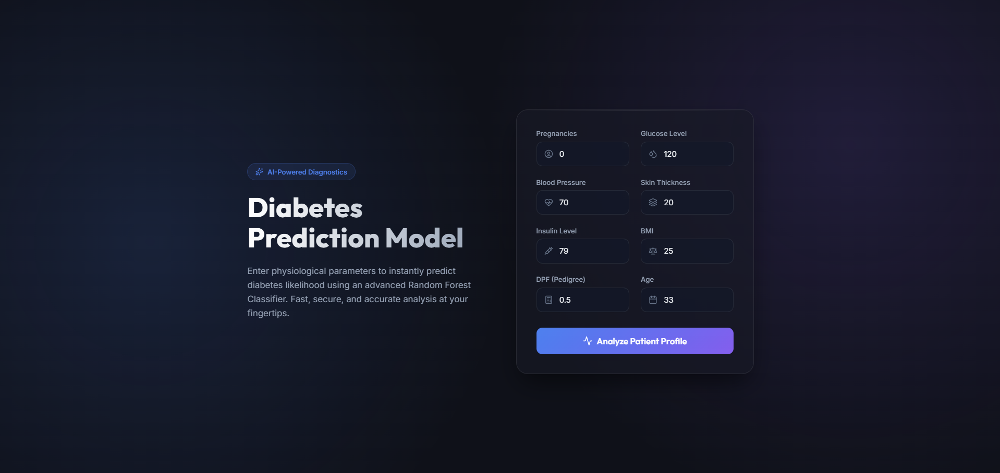

# 🩺 Diabetes Predictor (AI-Powered)

****
---


AI-powered Diabetes Prediction web application built with Flask, React, TypeScript and Docker.
---
## 📑 Table of Contents

- [🌟 What Does This App Do?](#-what-does-this-app-do)
- [📸 Application Preview](#-application-preview)
- [🏗️ How It Was Built (The Tech Stack)](#️-how-it-was-built-the-tech-stack)
- [⚡ Quick Start](#-quick-start)
- [🚀 How to Run the App (1-Click Run!)](#-how-to-run-the-app-1-click-run)
- [🛑 How to Stop the App](#-how-to-stop-the-app)
- [🛠 Manual Setup](#-manual-setup)
- [📁 Repository Structure Overview](#-repository-structure-overview)
- [📜 License](#-license)


---

## 🌟 What Does This App Do?
This application uses a Machine Learning model (specifically, a *Random Forest Classifier*) that was trained on real historical medical data. By typing in 8 simple health metrics (like your Age, BMI, and Blood Pressure), the AI will instantly predict whether the patient is likely to have diabetes or not.

You simply type the numbers into a beautiful, glowing dashboard, click "Analyze", and the result appears instantly!

---


## 📸 Application Preview



---

## 🏗️ How It Was Built (The Tech Stack)
We built this application using a very clean, professional "Separation of Concerns" architecture. That means the "brain" and the "face" of the app are two completely separate pieces that talk to each other:

1. **The Backend (The Brain 🧠)**
   - Built with **Python** & **Flask**.
   - It holds the AI Model (`.pkl` file) and does all the hard math to generate predictions.
2. **The Frontend (The Face 🎨)**
   - Built with **React**, **TypeScript**, and **Vite**.
   - It provides the gorgeous, glass-like UI you see on your screen. It takes your input and securely asks the Backend for the answer.
3. **The Deployment (The Engine 🐳)**
   - Powered by **Docker**.
   - Docker wraps the entire Brain and Face into neat little packages (containers) so it works flawlessly on *any* computer without you needing to install Python or Node.js manually!

*(If you want to read more technical details, check out `references/Resource/TECH_STACK_AND_RESOURCES.md`)*

---

## ⚡ Quick Start

```bash
docker-compose up -d --build
```
Then open [http://localhost](http://localhost) in your browser.   
---


## 🚀 How to Run the App (1-Click Run!)

We have "Dockerized" this application. This means you **do not** need to install complex dependencies, mess with environments, or configure backend servers. 

All you need is [Docker Desktop](https://www.docker.com/products/docker-desktop/) installed on your computer.

### Step 1: Open your Terminal
Open your terminal (Command Prompt/PowerShell on Windows, or Terminal on Mac/Linux) and navigate to this project folder.

### Step 2: Run the Magic Command
Copy and paste this exact command into your terminal and hit Enter:

```bash
docker-compose up -d --build
```

### Step 3: Open the App!
Wait a few seconds for Docker to start the engines. Then, open your favorite web browser (Chrome, Safari, Edge) and go to:

👉 **[http://localhost](http://localhost)** 

*That's it! You are now using a fully deployed Artificial Intelligence application running locally on your own machine.*

---

## 🛑 How to Stop the App
When you are done testing the application, you can safely turn off the engines by returning to your terminal and running:

```bash
docker-compose down
```

---

## 🛠 Manual Setup

Backend

```bash
cd backend
pip install -r requirements.txt
python app.py
```


```bash
cd frontend
npm install
npm run dev
```

---

## 📁 Repository Structure Overview
For developers looking to explore the code, here is how the repository is organized cleanly:

- `/backend/` ➔ Contains the Python API, the AI model, and its Docker environment.
- `/frontend/` ➔ Contains the React codebase, beautiful CSS styles, and its Nginx/Docker environment.
- `/notebooks_and_data/` ➔ Contains the original research dataset and Jupyter Notebook used to train the AI.
- `/references/` ➔ Contains legacy templates and educational resource text.


---

## 📜 License
MIT License

